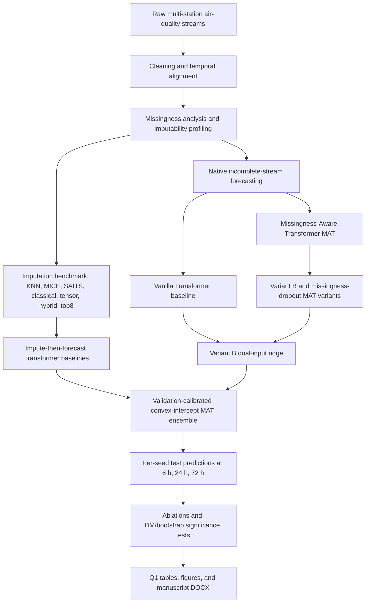

# Missingness-Aware Transformer for Multi-Pollutant Air Quality Forecasting

Code, experiments, and paper assets for *"A Missingness-Aware Transformer for
Multi-Pollutant Air Quality Forecasting on Severely Incomplete Monitoring
Data from Bangladesh."*

An end-to-end Transformer forecasts pollutants (primary target PM2.5; also
PM10, NO2, O3, CO, SO2) **directly from incomplete sensor streams** using
learned missingness embeddings and masked attention — no imputation stage —
and is compared against impute-then-forecast pipelines (KNN, MICE, and the
deep imputer **SAITS**), the missingness-native **GRU-D** RNN, modern
forecasters (**DLinear**, **PatchTST**), and statistical baselines.

**The claim is a predictive rule plus deployability, not raw accuracy:** across
**three monitoring networks** spanning the reconstructability spectrum (Dhaka,
Delhi, Beijing), the choice between end-to-end and impute-then-forecast is
governed by a **directly measured imputability** — the end-to-end advantage at
fixed severe outage declines monotonically with it and crosses zero, so a
practitioner can *measure imputability, then choose the paradigm*. On the
incomplete networks (Dhaka, Beijing), end-to-end missingness-aware forecasting
*matches* the strong impute-then-forecast pipelines — including a deep imputer —
at every horizon while removing the imputation stage. On the severely-incomplete
Dhaka network the missingness-dropout variant additionally degrades most
gracefully under realistic station outages and is best on high-pollution
episodes — an advantage that, we show honestly, is **specific to the
high-missingness, low-imputability regime** and does not carry over to the
more-imputable Delhi and Beijing networks (on complete, noisy Delhi the proposed
model is not even competitive on clean data — reported, not hidden).

**Everything runs on a desktop CPU**: small models (d_model 128, 3 layers,
~406k parameters), vanilla PyTorch, fixed seeds, deterministic flags. All
learned models are trained with **3 seeds (42/43/44)** and reported as
**mean ± std** — no single-seed number is ever reported where a multi-seed
one exists.

## 2026 Q1 update: final MAT ensemble

The latest paper-facing result is a **validation-calibrated MAT ensemble**
(`validation_convex_intercept_stack`). It uses validation-only calibration over
the MAT/Transformer family and is the final model used for the Q1 comparison
figures and manuscript assets.

PM2.5 test RMSE (ug/m3), 3-seed mean:

| Model | 6 h | 24 h | 72 h |
|---|---:|---:|---:|
| Vanilla Transformer | 68.61 | 78.31 | 81.83 |
| Variant B dual-input ridge | 67.28 | 75.08 | 79.33 |
| **Final validation-calibrated MAT ensemble** | **65.78** | **74.23** | **77.55** |

The final ensemble is the overall RMSE winner at all three horizons. It is
directionally better across all seeds and passes combined seed-level
Diebold-Mariano testing with Holm correction in **42/42 model-horizon
comparisons**. This is a combined seed-level significance claim; the stricter
requirement that every individual seed p-value is below 0.05 is reported
separately in the tables and is not the same claim.

Key artifacts:

- Winner summary:
  [`outputs/FINAL_WINNER.md`](outputs/FINAL_WINNER.md)
- Final comparison table:
  [`outputs/tables/final_mat_ensemble_comparison_summary.csv`](outputs/tables/final_mat_ensemble_comparison_summary.csv)
- Combined significance table:
  [`outputs/tables/combined_seed_significance_validation_convex_intercept_stack.csv`](outputs/tables/combined_seed_significance_validation_convex_intercept_stack.csv)
- Validation-calibrated ensemble summary:
  [`outputs/tables/validation_calibrated_ensemble_summary.csv`](outputs/tables/validation_calibrated_ensemble_summary.csv)
- Winning model test predictions:
  [`outputs/predictions/seeds/validation_convex_intercept_stack_s42_test.npz`](outputs/predictions/seeds/validation_convex_intercept_stack_s42_test.npz),
  [`outputs/predictions/seeds/validation_convex_intercept_stack_s43_test.npz`](outputs/predictions/seeds/validation_convex_intercept_stack_s43_test.npz),
  [`outputs/predictions/seeds/validation_convex_intercept_stack_s44_test.npz`](outputs/predictions/seeds/validation_convex_intercept_stack_s44_test.npz)
- Q1 comparison figures:
  [`outputs/figures/q1_final_mat_ensemble_summary_panel.png`](outputs/figures/q1_final_mat_ensemble_summary_panel.png)
- Draft Q1 journal manuscript:
  [`outputs/Q1_MAT_Ensemble_Journal_Paper.docx`](outputs/Q1_MAT_Ensemble_Journal_Paper.docx)

## Architecture pipeline



Reproduce the new result layer with:

```bash
python scripts/22_ablation_significance.py
python scripts/23_overall_model_significance.py
python scripts/24_validation_calibrated_ensembles.py
python scripts/27_combined_seed_significance.py
python scripts/28_make_final_mat_comparison_figures.py
python scripts/29_write_q1_journal_paper_docx.py
```

## Headline results

PM2.5 test RMSE (µg/m³) on the held-out 2024 year, observed targets only,
**3-seed mean ± std** for learned models (statistical baselines are
deterministic single runs):

| Model | 6 h | 24 h | 72 h |
|---|---|---|---|
| Persistence | 93.9 | 99.0 | 105.1 |
| SARIMA (per station) | 80.0 | 83.9 | 86.7 |
| LSTM | 68.20 ± 0.34 | 78.05 ± 0.08 | 80.95 ± 0.79 |
| GRU | 67.69 ± 0.47 | 76.45 ± 0.20 | **79.58 ± 0.37** |
| GRU-D | 68.89 ± 0.31 | 76.69 ± 0.49 | 80.61 ± 0.24 |
| DLinear | 70.51 ± 0.72 | 80.90 ± 1.34 | 83.55 ± 0.40 |
| PatchTST | 74.61 ± 1.07 | 84.34 ± 1.14 | 87.51 ± 1.34 |
| Two-stage (KNN → Transformer) | **66.95 ± 0.58** | 76.42 ± 0.75 | 80.95 ± 1.52 |
| Two-stage (MICE → Transformer) | 67.39 ± 0.25 | 76.81 ± 0.68 | 80.66 ± 1.13 |
| Two-stage (SAITS → Transformer) | 67.22 ± 0.82 | 76.31 ± 0.40 | 81.43 ± 1.15 |
| **Proposed (MAT)** | 67.03 ± 0.28 | 76.46 ± 0.51 | 81.54 ± 1.29 |
| **Proposed (variant B)** | 67.04 ± 0.29 | **76.00 ± 0.51** | 80.26 ± 1.36 |
| **Proposed + missingness dropout** | 67.48 ± 0.88 | 79.69 ± 1.77 | 81.54 ± 0.91 |

- **Accuracy parity, established honestly.** The proposed model, variant B,
  and all three two-stage pipelines (KNN, MICE, SAITS) sit inside each other's
  ±std at every horizon; per-seed Diebold–Mariano finds **no significant
  difference** against any of them. (A previously reported "two-stage KNN
  beats us at h24, p = 0.042" was a seed-42 artifact: across seeds
  p = 0.038 / 0.042 / 0.891. See [`outputs/RESULTS.md`](outputs/RESULTS.md).)
- **The headline: a missingness-severity crossover (two-factor, stated
  honestly).** Tracing the end-to-end *advantage* (best impute-then-forecast −
  best end-to-end RMSE) against effective input missingness shows the two
  networks behave **oppositely** under station outages. On **Dhaka** (severe,
  less-structured) end-to-end overtakes the best deep-imputer pipeline above
  **~38% effective missingness at 6 h**, and window-stratified on natural
  missingness it trails SAITS by 2.1 µg/m³ on the most complete windows but
  **leads by 2.3 µg/m³ on the most incomplete**. On **Beijing** (near-complete,
  highly periodic) the deep imputer wins under outages at *every* severity and
  its margin grows — strong diurnal structure keeps even long outage blocks
  imputable. Under cell-wise MCAR the deep imputer wins on both. So the choice
  depends on missingness severity **and series imputability**, not a single
  threshold; end-to-end forecasting helps in the high-missingness,
  low-imputability regime — the operational reality of incomplete networks.
- **A second monitoring network confirms parity.** On Beijing the proposed
  model and variant B are in fact *marginally the best* at 6 h (49.4 vs KNN
  49.7, SAITS 50.3 µg/m³), parity at the longer horizons.
- **High-pollution episodes** (Dhaka, observed PM2.5 > 150 µg/m³): proposed +
  missingness dropout is best at 6 h (130.2) and 24 h (125.3).
- **Strong baselines, not strawmen.** GRU-D (missingness-native RNN) does *not*
  beat the proposed transformer; PatchTST and DLinear are clearly behind and
  collapse under corruption — the parity result is against genuinely strong
  competitors, including a quality-gated deep imputer.
- **Deployability** is the practical edge that generalizes: the two-stage
  pipelines re-impute on every data refresh (SAITS imputer fit 5.6 min;
  re-imputation at inference); the end-to-end model runs at 1.8 ms/window with
  no imputation stage.

Full consolidated numbers and the frank robustness assessment:
[`outputs/RESULTS.md`](outputs/RESULTS.md).
All tables (CSV + booktabs LaTeX) in [`outputs/tables/`](outputs/tables/),
all figures (300-dpi PNG + vector PDF) in [`outputs/figures/`](outputs/figures/).
A second monitoring network (Beijing Multi-Site, UCI) is wired into the same
pipeline as an external-validity check; see [`COLAB.md`](COLAB.md). The
submission-ready manuscript is in [`paper/`](paper/) (build with
`latexmk -pdf main.tex`).

## Imputation-techniques benchmark (94 of 96 techniques covered)

Beyond the forecasting study, we benchmarked the **full imputation taxonomy** as a pure
*reconstruction* task: hide observed test-period cells, reconstruct them, and score on the
hidden cells via the same **imputability** axis used above
(`imputability = 1 − RMSE_method / RMSE_forward_fill`; **> 0 beats forward-fill**,
= 0 is forward-fill itself). The full run covers **60 reference implementations × 3 datasets
(Dhaka/Beijing/Delhi) × 2 missingness patterns (MCAR + outage)**.

Of a 96-technique survey taxonomy, **94 are covered**: **59 run** as real
reference implementations and **35 subsumed** into a mathematically/practically equivalent
run method (e.g. ARMA ⊂ ARIMA, LSTM ⊂ BRITS, BPCA ⊂ PPCA). **Only 2 remain impossible** —
Kriging (needs station lat/lon) and Cold deck (needs an external donor set). Methods marked ⁺
are from the extended set ([`src/imputation_benchmark_extended.py`](src/imputation_benchmark_extended.py));
several of those are representative approximations of a family, not line-for-line paper
reproductions — see `extended_coverage_map()`. Full coverage map:
[`outputs/imputation_benchmark/coverage_map.csv`](outputs/imputation_benchmark/coverage_map.csv).

The table lists every covered technique with the method it was run as, its family, the **best
imputability** that method reached across all six (dataset × pattern) cells, and **how many of
those six it beats forward-fill** (`Beats FF`). Subsumed techniques inherit their run method's
numbers. Full per-dataset leaderboards, figures, and analysis:
[`outputs/imputation_benchmark/ANALYSIS.md`](outputs/imputation_benchmark/ANALYSIS.md) and
[`outputs/imputation_benchmark_extended/`](outputs/imputation_benchmark_extended/).

> **Headline:** simple temporal methods still win — `linear_interp`, `last_and_next_mean`, `ssa`
> top most cells. The strongest *single newcomer* is **`tensor_cp`** (CP/PARAFAC of a
> day×hour×variable tensor): #1 on Beijing MCAR (+0.208) and #2 on Dhaka/Delhi MCAR, matching the
> best classical method. `rbi`/`irbi` reach the Beijing-outage top-3; `bayesnet_chowliu` and
> `grey_fcm` make the Delhi-outage top-5. Most other deep/ML/fuzzy methods stay below forward-fill.
> `csdi` diverged (excluded from figures — do not quote it).

**Ensemble result — `hybrid_top8`.** Merging the eight best methods into an
**imputability-weighted blend** (`tensor_cp`, `linear_interp`, `last_and_next_mean`, `ssa`,
`fcm_svr`, `som_lssvm`, `nearest_interp`, `mkl_cluster`; weights = their mean imputability,
renormalized per slice) produces the **overall #1 imputer of all 61** — mean imputability
**+0.218**, ahead of every individual member (`tensor_cp`/`linear_interp` +0.193). It is rank #1
in **4 of 6** dataset×pattern cells and beats forward-fill in **all 6**. The two exceptions are
honest: Beijing outage (#2 — `spatial_idw`'s +0.507 is in a class of its own there) and Delhi
outage (#9). So the blend wins by being *consistently* near-best across conditions rather than
spiking in one — the expected, useful behaviour of an ensemble. Implemented as `hybrid_top8` in
[`src/imputation_benchmark_extended.py`](src/imputation_benchmark_extended.py); it cannot see the
missingness pattern at impute time, so it uses one global weight set (deployment-realistic).

| # | Technique (taxonomy) | Status | Implemented as | Family | Best imputability | Beats FF |
|---:|---|---|---|---|---:|:--:|
| 1 | Row mean | subsumed | `mean` | mean-based | -0.027 | 0/6 |
| 2 | Mean top-bottom | subsumed | `last_and_next_mean` | mean-based | +0.265 | 6/6 |
| 3 | Hour mean | **run** | `hour_mean` | mean-based | +0.287 | 2/6 |
| 4 | 6-hour mean | subsumed | `hour_mean` | mean-based | +0.287 | 2/6 |
| 5 | 12-hour mean | subsumed | `hour_mean` | mean-based | +0.287 | 2/6 |
| 6 | Daily mean | **run** | `daily_mean` | mean-based | +0.095 | 3/6 |
| 7 | Last-and-next mean | **run** | `last_and_next_mean` | mean-based | +0.265 | 6/6 |
| 8 | Previous-year mean | subsumed | `daily_mean` | mean-based | +0.095 | 3/6 |
| 9 | Conditional mean imputation | **run** | `mice` | regression/MICE | +0.122 | 2/6 |
| 10 | Stochastic regression | **run** | `stochastic_regression` | regression/MICE | -0.218 | 0/6 |
| 11 | ARMA | subsumed | `arima` | state-space | +0.158 | 5/6 |
| 12 | ARIMA | **run** | `arima` | state-space | +0.158 | 5/6 |
| 13 | Linear interpolation | **run** | `linear_interp` | interpolation | +0.285 | 6/6 |
| 14 | Cubic interpolation | **run** | `cubic_spline` | interpolation | +0.136 | 2/6 |
| 15 | Inverse distance weighting | **run** | `spatial_idw` | spatial | +0.507 | 3/6 |
| 16 | Optimal interpolation | subsumed | `spatial_idw` | spatial | +0.507 | 3/6 |
| 17 | Nearest neighbor | **run** | `nearest_neighbor` | proximity | -0.179 | 0/6 |
| 18 | Hot deck | subsumed | `nearest_neighbor` | proximity | -0.179 | 0/6 |
| 19 | Multiple imputation | **run** | `mice` | regression/MICE | +0.122 | 2/6 |
| 20 | Maximum Likelihood Imputation (MLI) | **run** | `em_gaussian` | EM/MLE | +0.184 | 1/6 |
| 21 | Expectation Maximization (EM) | **run** | `em_gaussian` | EM/MLE | +0.184 | 1/6 |
| 22 | Full Information ML (FIML) | subsumed | `em_gaussian` | EM/MLE | +0.184 | 1/6 |
| 23 | Probabilistic Matrix Factorization (PMF) | **run** | `matrix_factorization` | matrix/PCA | -0.081 | 0/6 |
| 24 | Singular Value Decomposition (SVD) | **run** | `iterative_svd` | matrix/PCA | -0.027 | 0/6 |
| 25 | Tensor decomposition | **run** | `tensor_cp` ⁺ | tensor | +0.285 | 6/6 |
| 26 | Principal Component Analysis (PCA) | **run** | `iterative_svd` | matrix/PCA | -0.027 | 0/6 |
| 27 | Probabilistic PCA (PPCA) | **run** | `ppca` | matrix/PCA | +0.184 | 1/6 |
| 28 | Bayesian PCA (BPCA) | subsumed | `ppca` | matrix/PCA | +0.184 | 1/6 |
| 29 | K-Nearest Neighbor (KNN) | **run** | `knn` | proximity | +0.072 | 2/6 |
| 30 | Weighted KNN | **run** | `weighted_knn` | proximity | +0.072 | 2/6 |
| 31 | Sequential KNN | subsumed | `knn` | proximity | +0.072 | 2/6 |
| 32 | Gray KNN | **run** | `gray_knn` ⁺ | proximity | -0.027 | 0/6 |
| 33 | Modified/purity-based KNN | **run** | `purity_knn` ⁺ | proximity | -0.027 | 0/6 |
| 34 | Box-Jenkins time-series | subsumed | `arima` | state-space | +0.158 | 5/6 |
| 35 | Kalman filter / smoothing / state-space | **run** | `kalman_smoother` | state-space | -0.027 | 0/6 |
| 36 | Singular Spectrum Analysis (SSA) | **run** | `ssa` | state-space | +0.212 | 6/6 |
| 37 | Kernel-based imputation | **run** | `kernel_nw` ⁺ | kernel | -0.027 | 0/6 |
| 38 | Mixture-kernel imputation | **run** | `mixture_kernel` ⁺ | kernel | -0.027 | 0/6 |
| 39 | Ratio-Based Imputation (RBI) | **run** | `rbi` ⁺ | ratio | +0.185 | 3/6 |
| 40 | Iterative RBI (IRBI) | **run** | `irbi` ⁺ | ratio | +0.185 | 3/6 |
| 41 | Bayesian imputation | subsumed | `stochastic_regression` | regression/MICE | -0.218 | 0/6 |
| 42 | MCMC / Data Augmentation | subsumed | `stochastic_regression` | regression/MICE | -0.218 | 0/6 |
| 43 | MICE | **run** | `mice` | regression/MICE | +0.122 | 2/6 |
| 44 | EM with Bootstrapping (EMB / Amelia II) | **run** | `emb_bootstrap` | EM/MLE | +0.184 | 1/6 |
| 45 | Multilayer Perceptron (MLP) | **run** | `autoencoder` | deep-AE | -0.027 | 0/6 |
| 46 | Radial Basis Function (RBF) | **run** | `rbf_net` ⁺ | kernel | +0.044 | 2/6 |
| 47 | Auto-associative neural network | subsumed | `autoencoder` | deep-AE | -0.027 | 0/6 |
| 48 | Probabilistic Neural Network (PNN) | **run** | `grnn_pnn` ⁺ | kernel | -0.027 | 0/6 |
| 49 | Bayesian network imputation | **run** | `bayesnet_chowliu` ⁺ | EM/MLE | +0.191 | 2/6 |
| 50 | Support Vector Machine (SVM) | **run** | `svr_regression` | ML-SVM | +0.034 | 1/6 |
| 51 | Least-Squares SVM | subsumed | `svr_regression` | ML-SVM | +0.034 | 1/6 |
| 52 | Decision Tree (ID3/C4.5/CART) | **run** | `decision_tree_cart` | ML-tree | -0.107 | 0/6 |
| 53 | EMI/DMI/SiMI tree extensions | **run** | `dmi_tree` ⁺ | ML-tree | +0.111 | 3/6 |
| 54 | Random Forest / MissForest | **run** | `missforest_rf` | ML-tree | +0.052 | 1/6 |
| 55 | RF proximity/on-the-fly/multivariate | subsumed | `missforest_rf` | ML-tree | +0.052 | 1/6 |
| 56 | Single-view clustering | **run** | `kmeans` | clustering | -0.026 | 0/6 |
| 57 | Multi-view / subspace / MKL clustering | **run** | `subspace_cluster` ⁺ | clustering | +0.145 | 3/6 |
| 58 | k-means clustering | **run** | `kmeans` | clustering | -0.026 | 0/6 |
| 59 | Self-Organizing Map (SOM) | **run** | `som` | clustering | -0.126 | 0/6 |
| 60 | Fuzzy rule-based / fuzzy rough | **run** | `fuzzy_rough` ⁺ | fuzzy | -0.027 | 0/6 |
| 61 | Fuzzy clustering / c-means / k-means | **run** | `fuzzy_cmeans` | fuzzy | -0.025 | 0/6 |
| 62 | Fuzzy neighborhood density clustering | **run** | `fuzzy_nd` ⁺ | fuzzy | -0.027 | 0/6 |
| 63 | Grey-system fuzzy c-means | **run** | `grey_fcm` ⁺ | fuzzy | +0.186 | 2/6 |
| 64 | Iterative fuzzy k-means / IFC | subsumed | `fuzzy_cmeans` | fuzzy | -0.025 | 0/6 |
| 65 | DFIC / D-ANFIS | subsumed | `fcm_svr` ⁺ | hybrid | +0.161 | 4/6 |
| 66 | Deep autoencoder | **run** | `autoencoder` | deep-AE | -0.027 | 0/6 |
| 67 | Backpropagation autoencoder | subsumed | `autoencoder` | deep-AE | -0.027 | 0/6 |
| 68 | Variational autoencoder | **run** | `gpvae` | deep-AE | -0.028 | 0/6 |
| 69 | Denoising autoencoder | **run** | `denoising_ae` | deep-AE | -0.030 | 0/6 |
| 70 | Stacked / multimodal denoising AE | subsumed | `denoising_ae` | deep-AE | -0.030 | 0/6 |
| 71 | RNN | subsumed | `brits` | deep-RNN | +0.117 | 3/6 |
| 72 | GRU | subsumed | `grud` | deep-RNN | +0.076 | 1/6 |
| 73 | LSTM | subsumed | `brits` | deep-RNN | +0.117 | 3/6 |
| 74 | ConvLSTM | **run** | `convlstm` ⁺ | deep-RNN | -0.010 | 0/6 |
| 75 | Transfer/iterative LSTM imputation | subsumed | `brits` | deep-RNN | +0.117 | 3/6 |
| 76 | GRU-D | **run** | `grud` | deep-RNN | +0.076 | 1/6 |
| 77 | M-RNN | **run** | `mrnn` | deep-RNN | -0.072 | 0/6 |
| 78 | CNN / ST-spectral CNN | subsumed | `timesnet` | deep-attention | +0.116 | 2/6 |
| 79 | GAN | subsumed | `usgan` | deep-GAN | +0.151 | 2/6 |
| 80 | GAIN | subsumed | `usgan` | deep-GAN | +0.151 | 2/6 |
| 81 | Multi-channel CNN + DCGAN | **run** | `cnn_gan` ⁺ | deep-GAN | -0.090 | 0/6 |
| 82 | SAITS / Transformer imputation | **run** | `saits` | deep-attention | +0.086 | 2/6 |
| 83 | CSDI (diffusion) | **run** | `csdi` | deep-attention | -1.589 | 0/6 |
| 84 | TimesNet | **run** | `timesnet` | deep-attention | +0.116 | 2/6 |
| 85 | Hybrid: MICE + KNN | subsumed | `mice` | regression/MICE | +0.122 | 2/6 |
| 86 | Hybrid: FCM + SVR + GA | **run** | `fcm_svr` ⁺ | hybrid | +0.161 | 4/6 |
| 87 | Hybrid: SOM + FOA + LS-SVM | **run** | `som_lssvm` ⁺ | hybrid | +0.146 | 4/6 |
| 88 | Hybrid: multiple kernel clustering | **run** | `mkl_cluster` ⁺ | hybrid | +0.178 | 4/6 |
| 89 | Hybrid: bagging / block-bootstrap | subsumed | `emb_bootstrap` | EM/MLE | +0.184 | 1/6 |
| 90 | Hybrid: Stineman / weighted moving avg | subsumed | `last_and_next_mean` | mean-based | +0.265 | 6/6 |
| 91 | Hybrid: Kalman-filter hybrids | subsumed | `kalman_smoother` | state-space | -0.027 | 0/6 |
| 92 | Hybrid: KNN + penalized dissimilarity | subsumed | `weighted_knn` | proximity | +0.072 | 2/6 |
| 93 | Hybrid: SOM + KNN ensemble | subsumed | `som` | clustering | -0.126 | 0/6 |
| 94 | Hybrid: LSTM + transfer / bidirectional | subsumed | `brits` | deep-RNN | +0.117 | 3/6 |

## Data

Hourly air quality + meteorology from 16 CAMS monitoring stations across
Bangladesh, 2022–2024 (three Excel files in `data/raw/`). The raw files are
messy by construction: per-station blocks each headed by a units row, the
2024 file has PM2.5/PM10 in swapped column order, station names vary across
years, missingness ranges from ~10% to 100% per station × variable, and the
2024 PM sensors emit verbatim saturation/error codes (985.0, 999.99 —
thousands of occurrences, physically impossible in monsoon months). All
handling — unit-row stripping, plausibility bounds, sentinel codes,
stuck-sensor runs — is documented in
[`outputs/data_cleaning_report.md`](outputs/data_cleaning_report.md).

Missingness itself is a study object (a paper section): PM2.5 is 23.7%
missing overall (10–45% per station), missingness is demonstrably not MCAR
(predictable from meteorology + season, AUC 0.61), and station-level outages
dominate the long-gap mass — which motivates both the model design and the
outage-style robustness experiment.

Two further networks place the study on a **measured-imputability** axis (see
`config_beijing.yaml`, `config_delhi.yaml`): the near-complete **Beijing
Multi-Site** benchmark (2.1% missing) and the complete-but-noisy **Delhi CPCB**
network. The headline finding is a **predictive deployment rule** — the
end-to-end advantage at fixed severe outage declines monotonically with a
directly measured imputability (1 − RMSE_SAITS/RMSE_ffill on held-out observed
cells) and crosses zero: Dhaka (imputability −0.39) favors end-to-end, while the
more-imputable Delhi (−0.09) and Beijing (+0.20) favor impute-then-forecast.
*Measure a network's imputability, then choose the paradigm.* See
[`outputs/RESULTS.md`](outputs/RESULTS.md) for the full three-network results.

## Setup

```bash
python -m venv .venv && .venv/Scripts/activate    # Windows
pip install -r requirements.txt                    # torch = CPU build
```

Python ≥ 3.10. All package versions pinned in `requirements.txt`.

## Reproducing everything

Each stage is one CLI command; `config.yaml` is the single source of truth
for every path, hyperparameter, seed, bound, and ablation switch.

```bash
python scripts/01_prepare_data.py         --config config.yaml  # xlsx -> parquet + cleaning report
python scripts/02_missingness_analysis.py --config config.yaml  # missingness tables + figures
python -m src.data.dataset                --config config.yaml  # windows, scalers, count tables
python scripts/03_train_baselines.py      --config config.yaml  # baselines x 3 seeds (--seeds 42,43,44)
python scripts/04_train_proposed.py       --config config.yaml --seeds 42,43,44          # proposed
python scripts/04_train_proposed.py       --config config.yaml --seeds 42,43,44 --variant B --name variant_B
python scripts/04_train_proposed.py       --config config.yaml --seeds 42,43,44 --miss-dropout
python scripts/05_ablations.py            --config config.yaml  # ablations + robustness suite
python scripts/05_ablations.py            --config config.yaml --export-seed-predictions  # per-seed bundles
python scripts/06_interpretability.py     --config config.yaml  # attention + importance
python scripts/07_make_paper_assets.py    --config config.yaml  # regenerate ALL tables + figures
python -m src.evaluate                    --config config.yaml  # metrics + significance tests
```

Learned models train with three seeds; per-seed prediction bundles land in
`outputs/predictions/seeds/`, the canonical seed-42 bundle stays at the top
level. Every (model, seed) run is skipped when its bundle already exists, so
all long runs **resume automatically**. The second dataset runs the identical
pipeline via `--config config_beijing.yaml` (training on Colab T4 — see
[`COLAB.md`](COLAB.md)); script 07 gains `--secondary-config config_beijing.yaml`
for the cross-dataset summary table.

```bash
python -m pytest tests/    # 82 tests: unit-row stripping, mask/leakage
                           # contracts, scaler-on-train-only, model shapes +
                           # determinism + mask-poisoning for every new model,
                           # multi-seed aggregation, per-seed significance,
                           # SAITS imputer, Beijing loader, ...
```

## Train / validation / test split

Chronological, no leakage:

| Split | Period | Windows |
|-------|--------|---------|
| train | 2022-01-01 – 2023-09-30 | 9,000 |
| val   | 2023-10-01 – 2023-12-31 | 1,420 |
| test  | 2024-01-01 – 2024-12-31 | 5,578 |

Air-quality series are strongly autocorrelated and seasonal, so random
splits leak future information through overlapping windows; a strictly
chronological split with the entire final year held out is the most honest
protocol and also tests cross-year generalization. Per-variable
standardization scalers are fit on the training period only, ignoring NaNs
(persisted in `data/processed/scalers.json`).

**Window/split assignment rule.** A window consists of 168 input hours
ending at anchor time *t*, with targets at *t*+6 h, *t*+24 h, *t*+72 h. A
window belongs to a split iff **all** of its horizon timestamps fall inside
that split's range. Inputs may reach back across the boundary
(deployment-realistic; inputs always precede targets, so nothing leaks). A
window is **usable** iff at least one (target pollutant, horizon) value is
observed; inputs may be arbitrarily incomplete — handling that is the
model's job. Loss and metrics are computed only over observed targets via
per-sample target masks.

## Model

```
x = value_proj(values) + miss_proj(1 - mask) + time_proj(time_feats)
    + station_embed + positional_encoding
```

`miss_proj` is a learned per-variable missingness embedding (so "absent" is
distinguishable from "measured zero"). The encoder is a vanilla pre-norm
`nn.TransformerEncoder` (3 layers, d_model 128, 8 heads, FFN 256). Variant B
(config switch, significantly best at h72) additionally masks attention to
timesteps where the primary target is unobserved. Multi-horizon linear heads;
masked-MSE loss over observed targets only. The two-stage baselines use a
size-identical vanilla Transformer on inputs imputed by KNN, MICE, or SAITS
(a deep self-attention imputer trained on train-period rows only), isolating
the contribution of native missingness handling.

Baselines live in `src/models/` behind a unified `forward(batch) -> (B, T, H)`
contract and a name registry (`src/models/factory.py`): the missingness-native
**GRU-D** (Che et al. 2018; learned input/hidden decay), **DLinear** (Zeng et
al. 2023), **PatchTST** (Nie et al. 2023), the **SAITS** imputer (Du et al.
2023, minimal in-repo implementation), LSTM/GRU, and persistence /
seasonal-naive / SARIMA.

## Repository layout

```
config.yaml                  # single source of truth for ALL hyperparameters
config_beijing.yaml          # second dataset, same pipeline (outputs/beijing/)
src/data/                    # load, clean, dataset/windowing, impute, load_beijing
src/models/                  # proposed model + all baselines + factory
src/train.py                 # unified training loop (early stop, checkpoints, device)
src/evaluate.py              # metrics, multi-seed tables, per-seed DM, episode, figures
src/interpret.py             # attention extraction + feature importance
scripts/01..07_*.py          # one CLI per pipeline stage (+ 01b_prepare_beijing)
scripts/colab_run_beijing.py # one-command Beijing grid for Colab T4 (see COLAB.md)
tests/                       # 82 unit tests
outputs/                     # RESULTS.md, tables/, figures/, checkpoints/,
                             # predictions/ (+ predictions/seeds/), reports
UPGRADE_LOG.md               # change log: what ran, wall-clock, contradictions
data/raw/                    # the 3 source xlsx files (+ raw/beijing/ CSVs)
data/processed/              # cleaned parquet + scalers (per dataset)
```
